## 基于JavaWeb仿携程租车模块开发的汽车租赁系统
### 开发工具
MyEclipse 2017
### 开发环境
- JDK 1.8
- MySQL 5.1.13
### 开发技术栈
- 后端：Servlet+JSP+JDBC
- 前端：HTML+CSS+原生JS+Ajax
### 项目启动说明
1、系统主页：http://localhost:8080/carLeaseSystem/home.jsp

2、后台登录地址：http://localhost:8080/carLeaseSystem/worker/login.jsp
### 权限说明
#### 游客角色
进入页面可以不用登陆，可以根据前台输入租车地、换车地、租车时间、换车时间信息传入后台检索车辆信息。可以根据不同型号和不同租车公司进行租车查询，查看租车价格，价格可以由低到高或者由高到低进行查询。进行下单后需要游客用户输入姓名、身份证、手机号等信息进行租车确认。

#### 用户角色
首先要注册个人基本信息，然后生成一个帐号，用户需要记住，然后登录页面。可以根据前台输入租车地、换车地、租车时间、换车时间信息传入后台检索车辆信息。进入下单页面可以自动生成个人信息进行租车，个人信息可以进行修改，然后即可进行租车确认。

#### 工作人员角色
首页要进行管理员登录，管理员后台可以显示他所负责的订单，并进行处理，比如修改订单状态、修改用户信誉度。可以和客户进行沟通商讨细节，订单完成后完善订单，查看否有车辆损坏或者交通罚款。
### 页面截图
用户注册页
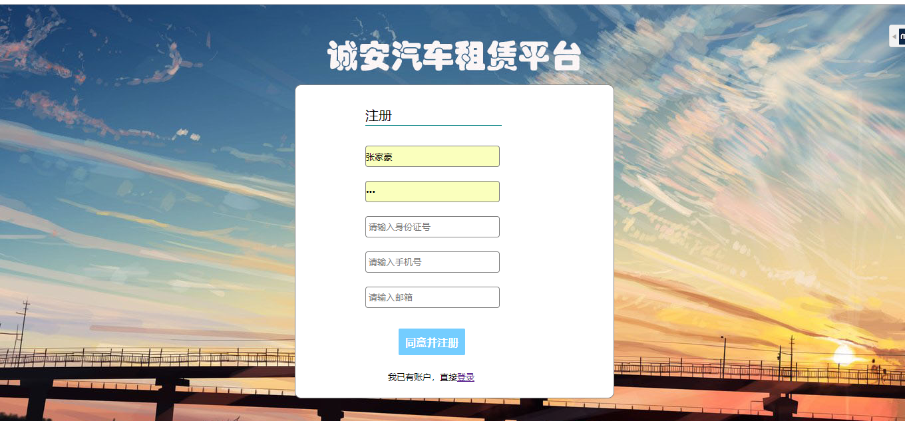

用户登录页
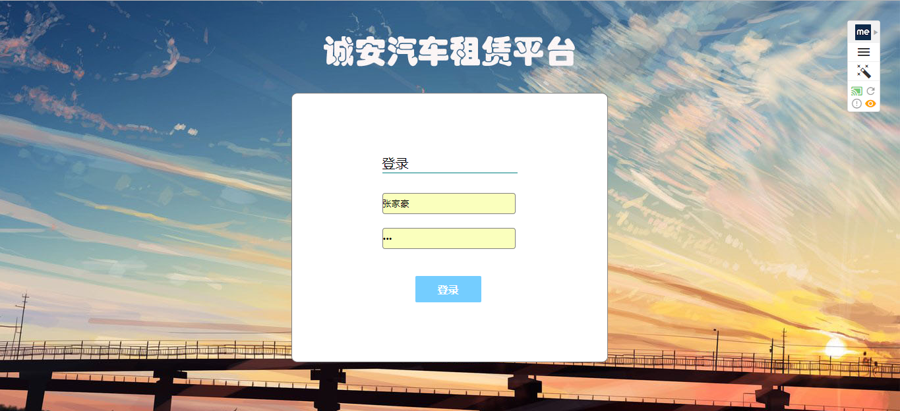

系统主页
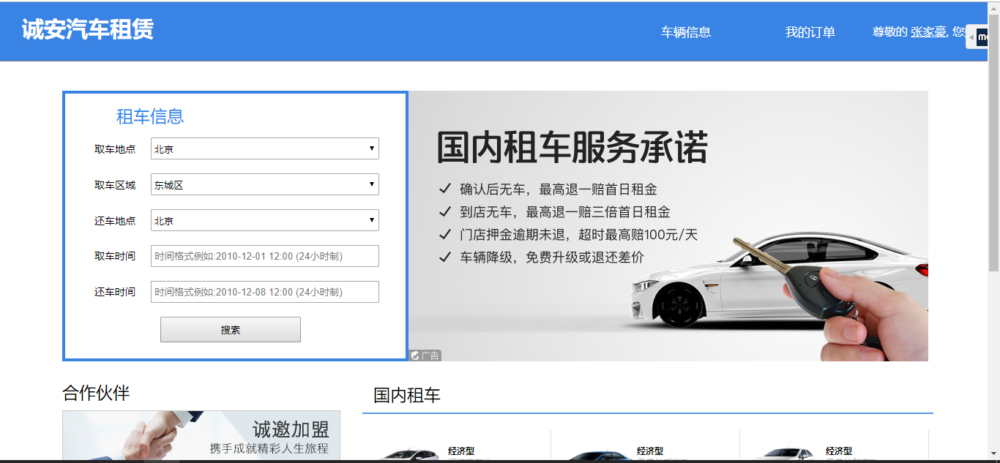

车辆异步查询页
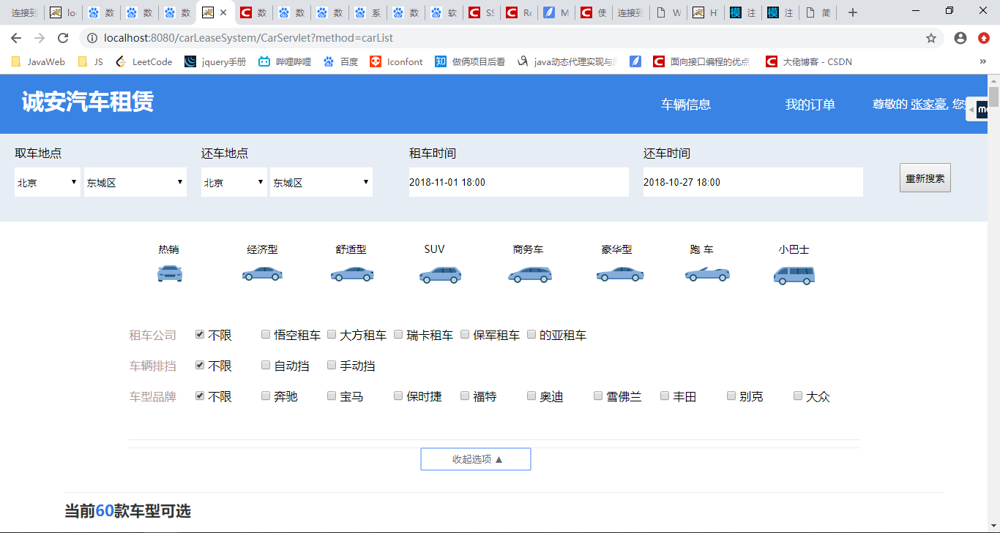

车辆列表展示页
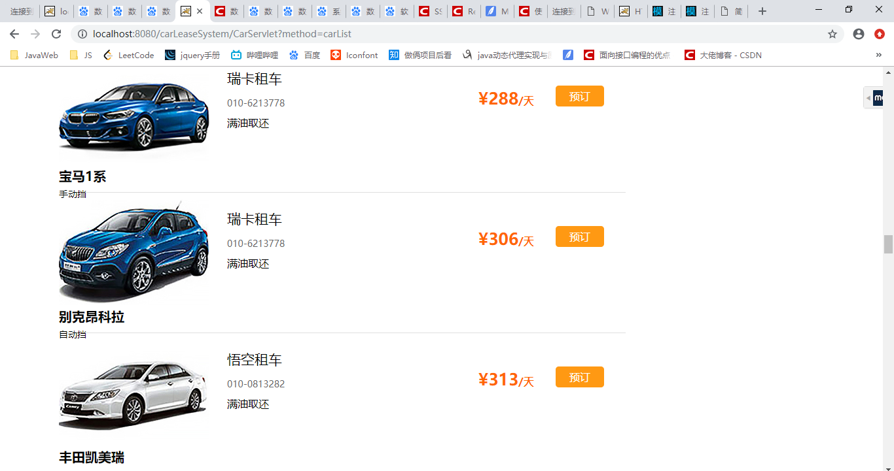

车辆预定页
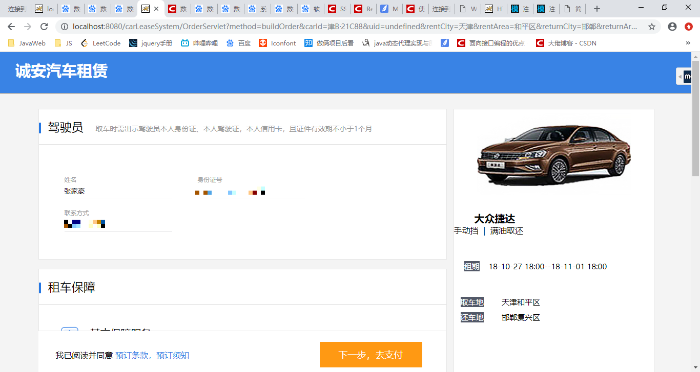

我的订单页
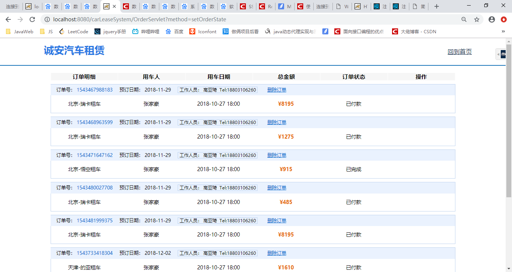

车辆付款页
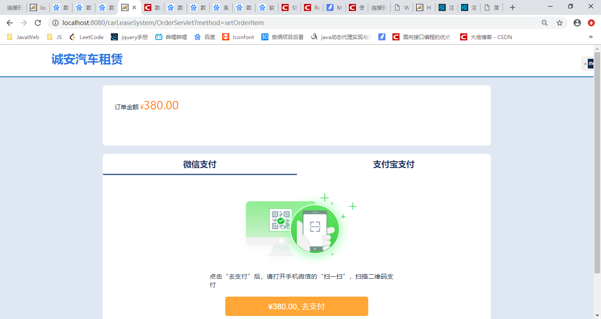

worker登录页
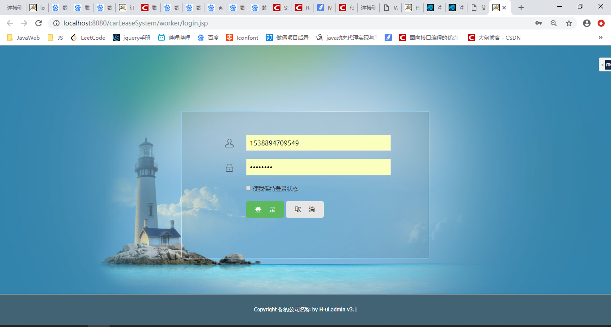

worker所有订单页
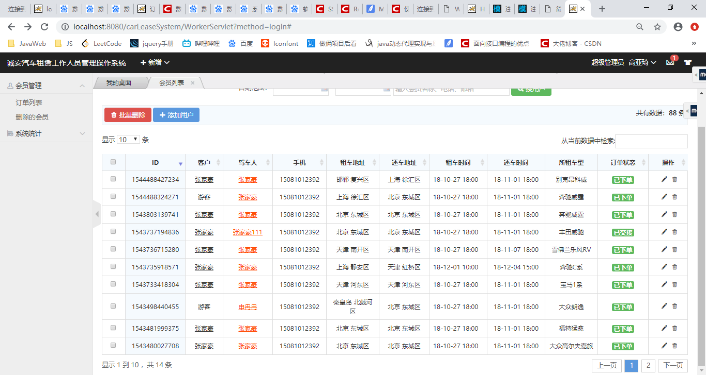

worker订单编辑页
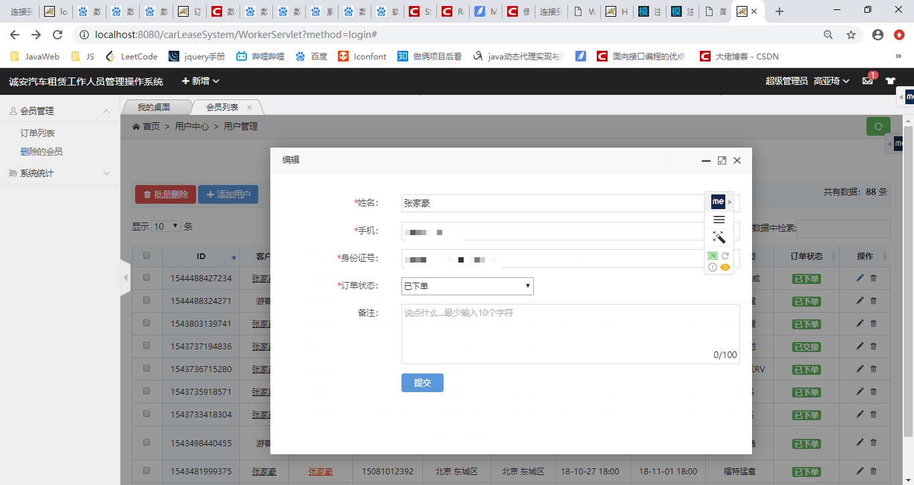
